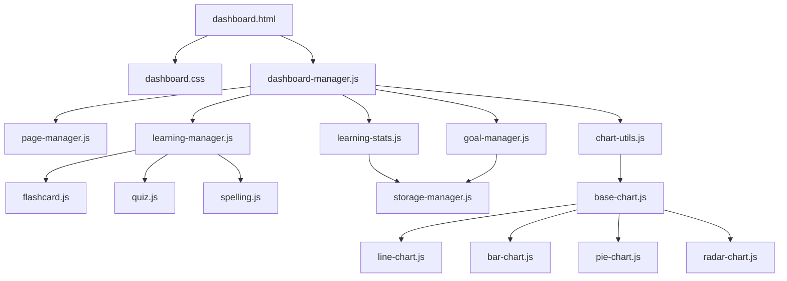

# Dashboard 技术规范文档

## 1. 项目概述

### 1.1 项目背景
单词翻译助手需要一个功能丰富的学习Dashboard，用于展示详细的学习记录、提供多种学习模式选择，并具备良好的可扩展性，支持未来功能的持续迭代。

### 1.2 项目目标
- 提供直观的学习概览和详细的学习记录
- 支持多种学习模式，满足不同学习需求
- 实现数据可视化，帮助用户了解学习趋势
- 具备良好的可扩展性，支持未来功能拓展
- 提供现代化的用户界面和良好的用户体验

### 1.3 核心功能
- 学习概览展示
- 学习模式选择
- 详细学习记录
- 数据可视化
- 学习目标设置
- 可扩展的插件系统

## 2. 技术架构

### 2.1 系统架构
```
┌──────────────────────────────────────────────────────────────┐
│                      客户端应用层                          │
├──────────────────────────────────────────────────────────────┤
│  Dashboard UI Components  │  Learning Mode Components       │
├──────────────────────────────────────────────────────────────┤
│                      业务逻辑层                          │
├──────────────────────────────────────────────────────────────┤
│  Dashboard Manager        │  Learning Manager              │
├──────────────────────────────────────────────────────────────┤
│                      数据访问层                          │
├──────────────────────────────────────────────────────────────┤
│  Storage Manager          │  API Manager                  │
├──────────────────────────────────────────────────────────────┤
│                      数据存储层                          │
├──────────────────────────────────────────────────────────────┤
│  Local Storage            │  Chrome Storage               │
└──────────────────────────────────────────────────────────────┘
```

### 2.2 技术栈
- **前端框架**：原生 JavaScript (ES6+)
- **构建工具**：无（原生模块系统）
- **样式方案**：CSS Modules + CSS Variables
- **数据可视化**：Chart.js
- **状态管理**：自定义状态管理
- **路由管理**：自定义路由系统
- **测试框架**：Jest + Puppeteer

### 2.3 模块化设计

#### 2.3.1 核心模块
| 模块名称 | 主要职责 | 文件位置 |
|---------|---------|----------|
| Dashboard Manager | Dashboard 核心逻辑 | popup/modules/dashboard-manager.js |
| Learning Manager | 学习模式管理 | popup/modules/learning-manager.js |
| Storage Manager | 数据存储管理 | core/storage-manager.js |
| API Manager | API 请求管理 | core/api-manager.js |
| Page Manager | 页面导航管理 | popup/modules/page-manager.js |

#### 2.3.2 UI 组件
| 组件类型 | 主要组件 | 文件位置 |
|---------|---------|----------|
| 布局组件 | Header, Sidebar, MainContent | components/layouts/ |
| 数据组件 | StatsCard, ProgressBar, Chart | components/data/ |
| 学习组件 | LearningModeSelector, Flashcard, Quiz, Spelling | popup/components/ |
| 表单组件 | Input, Select, Button | components/forms/ |
| 图表组件 | LineChart, BarChart, PieChart | components/charts/ |

## 3. 文件结构

### 3.1 核心文件结构
```
├── popup/
│   ├── dashboard.html          # Dashboard 主页面
│   ├── css/
│   │   ├── dashboard.css       # Dashboard 主样式
│   │   ├── charts.css          # 图表组件样式
│   │   └── learning-modes.css  # 学习模式样式
│   ├── components/
│   │   ├── layouts/
│   │   │   ├── dashboard-layout.js    # Dashboard 布局组件
│   │   │   ├── header.js              # 顶部导航组件
│   │   │   └── sidebar.js             # 侧边栏组件
│   │   ├── data/
│   │   │   ├── stats-card.js          # 统计卡片组件
│   │   │   ├── record-list.js         # 学习记录列表
│   │   │   └── progress-bar.js        # 进度条组件
│   │   ├── learning/
│   │   │   ├── learning-mode-selector.js  # 学习模式选择器
│   │   │   ├── flashcard.js                # 闪卡模式组件
│   │   │   ├── quiz.js                     # 测验模式组件
│   │   │   └── spelling.js                 # 拼写模式组件
│   │   ├── forms/
│   │   │   ├── goal-setting.js        # 学习目标设置表单
│   │   │   └── filter-form.js         # 筛选表单组件
│   │   └── charts/
│   │       ├── base-chart.js          # 基础图表组件
│   │       ├── line-chart.js          # 折线图组件
│   │       ├── bar-chart.js           # 柱状图组件
│   │       ├── pie-chart.js           # 饼图组件
│   │       └── radar-chart.js         # 雷达图组件
│   └── modules/
│       ├── dashboard-manager.js       # Dashboard 核心逻辑
│       ├── page-manager.js            # 页面导航管理
│       ├── learning-manager.js        # 学习模式管理
│       ├── learning-stats.js          # 学习统计数据
│       └── goal-manager.js            # 学习目标管理
├── core/
│   ├── storage-manager.js             # 数据存储管理
│   ├── api-manager.js                 # API 请求管理
│   ├── sync-manager.js                # 多设备同步管理
│   └── plugin-system.js               # 插件系统
├── utils/
│   ├── chart-utils.js                 # 图表工具函数
│   ├── data-utils.js                  # 数据处理工具
│   └── date-utils.js                  # 日期处理工具
└── DASHBOARD_SPECIFICATION.md         # 本规范文件
```

### 3.2 文件依赖关系



## 4. 核心功能设计

### 4.1 学习概览

#### 4.1.1 功能描述
展示用户的核心学习数据，包括今日学习进度、掌握程度、待复习单词、连续学习天数和总学习词数等。

#### 4.1.2 数据结构
```javascript
{
  todayLearned: 15,              // 今日学习单词数
  masteryLevel: 85,              // 掌握程度（百分比）
  toReview: 20,                  // 待复习单词数
  streakDays: 7,                // 连续学习天数
  totalWords: 500,              // 总学习单词数
  dailyGoal: 20                 // 每日学习目标
}
```

#### 4.1.3 实现详情

**核心文件：**
- `popup/dashboard.js` - 主要实现统计卡片组件和数据可视化
- `popup/css/dashboard.css` - 学习概览样式
- `popup/dashboard.html` - 学习概览页面结构

**卡片类型：**
1. **今日学习卡片** - 展示今日学习单词数和完成度
   - 包含进度条动画效果
   - 显示每日学习目标
   - 动态计算完成百分比

2. **掌握程度卡片** - 环形进度图展示掌握程度
   - Canvas绘制的环形进度图
   - 支持0%到100%的可视化展示
   - 包含百分比文本显示

3. **待复习卡片** - 待复习单词数量和可视化提示
   - 动态生成提醒图标
   - 支持数量超过10个的缩略显示
   - 弹跳动画效果

4. **连续学习卡片** - 连续学习天数和学习热力图
   - 显示连续学习天数
   - 生成学习热力图日历
   - 渐变背景效果

5. **总学习词数卡片** - 展示累计学习单词数
   - 大字体突出显示
   - 简洁的统计展示

**数据可视化：**
- 环形进度图（Canvas实现）
- 线性进度条（CSS动画）
- 学习热力图（动态生成的方格矩阵）
- 单词学习趋势图（Canvas实现的折线图）

#### 4.1.4 UI 设计
- 卡片式网格布局，响应式设计
- 卡片悬停效果和点击交互
- 渐入和缩放动画效果
- 主题适配（浅色/深色模式）
- SVG图标统一放置在卡片右上角
- 数据驱动的动态样式

### 4.2 学习模式选择

#### 4.2.1 功能描述
提供多种学习模式，包括闪卡、测验、拼写、听力等，支持用户选择适合自己的学习方式。

#### 4.2.2 模式定义
```javascript
const learningModes = [
  {
    id: 'flashcard',
    name: '闪卡模式',
    description: '传统闪卡学习，支持正反翻转',
    icon: '📇',
    enabled: true
  },
  {
    id: 'quiz',
    name: '测验模式',
    description: '选择题形式，测试单词掌握程度',
    icon: '📝',
    enabled: true
  },
  // 更多模式...
];
```

#### 4.2.3 模式扩展机制
- 支持动态注册新的学习模式
- 每个模式独立封装，便于维护和扩展
- 提供统一的模式接口，确保兼容性

### 4.3 学习记录详情

#### 4.3.1 功能描述
展示详细的学习记录，包括学习时间、单词、正确率、难度等信息，支持多种筛选和排序方式。

#### 4.3.2 数据结构
```javascript
{
  records: [
    {
      id: 'rec_123',
      word: 'example',
      translation: '例子',
      timestamp: '2026-01-11T10:30:00Z',
      mode: 'flashcard',
      correct: true,
      difficulty: 'easy',
      duration: 5000, // 毫秒
      type: 'word', // word, phrase, sentence
      starred: false
    },
    // 更多记录...
  ],
  pagination: {
    currentPage: 1,
    totalPages: 5,
    pageSize: 20,
    totalRecords: 100
  }
}
```

#### 4.3.3 实现详情

**核心文件：**
- `components/complex/word-card.js` - 学习记录卡片组件
- `popup/modules/learning-stats.js` - 学习记录数据管理
- `popup/dashboard.html` - 学习记录页面结构

**记录卡片功能：**
1. **多种记录类型支持**
   - 支持单词、短语、句子三种记录类型
   - 不同类型记录有不同的卡片样式
   - 支持收藏功能

2. **记录详情展示**
   - 显示单词、翻译、学习时间
   - 显示学习模式、难度、正确率
   - 显示学习时长

3. **交互功能**
   - 支持点击查看详细信息
   - 支持收藏/取消收藏
   - 支持删除记录
   - 支持编辑记录

#### 4.3.4 查询和筛选功能

**查询功能：**
- 支持按单词或翻译内容搜索
- 支持搜索历史记录
- 支持搜索建议

**筛选功能：**
- 按日期范围筛选
- 按学习模式筛选（闪卡、测验、拼写）
- 按难度筛选（简单、中等、困难）
- 按正确率筛选（正确、错误）
- 按记录类型筛选（单词、短语、句子）
- 按收藏状态筛选

**排序功能：**
- 按时间排序（最新、最旧）
- 按学习时长排序
- 按难度排序

#### 4.3.5 分页功能
- 支持自定义每页显示数量（10、20、50、100）
- 显示总记录数和总页数
- 支持跳转到指定页码
- 支持上一页/下一页导航

#### 4.3.6 数据导出功能
- 支持导出为CSV格式
- 支持导出为JSON格式
- 支持按筛选条件导出
- 支持导出所有记录或当前页记录

### 4.4 数据可视化

#### 4.4.1 图表类型
- **趋势图**：展示学习进度和掌握程度的变化趋势
- **分布饼图**：展示不同难度单词的分布情况
- **掌握程度图**：展示不同学习模式的掌握程度
- **学习时间图**：展示学习时间分布

#### 4.4.2 图表配置
```javascript
const chartConfig = {
  type: 'line',
  data: {
    labels: ['周一', '周二', '周三', '周四', '周五', '周六', '周日'],
    datasets: [{
      label: '学习单词数',
      data: [15, 20, 18, 25, 22, 30, 28],
      borderColor: '#667eea',
      backgroundColor: 'rgba(102, 126, 234, 0.1)',
      tension: 0.4
    }]
  },
  options: {
    responsive: true,
    maintainAspectRatio: false,
    plugins: {
      legend: {
        display: true,
        position: 'top'
      },
      tooltip: {
        mode: 'index',
        intersect: false
      }
    }
  }
};
```

## 5. 数据模型

### 5.1 学习记录模型

```javascript
class LearningRecord {
  constructor({
    id,          // 记录 ID
    word,        // 单词
    translation, // 翻译
    timestamp,   // 学习时间
    mode,        // 学习模式
    correct,     // 是否正确
    difficulty,  // 难度
    duration     // 学习时长
  }) {
    this.id = id || generateId();
    this.word = word;
    this.translation = translation;
    this.timestamp = timestamp || new Date().toISOString();
    this.mode = mode;
    this.correct = correct;
    this.difficulty = difficulty || 'medium';
    this.duration = duration || 0;
  }
}
```

### 5.2 学习统计模型

```javascript
class LearningStats {
  constructor({
    todayLearned,    // 今日学习单词数
    masteryLevel,    // 掌握程度
    toReview,        // 待复习单词数
    streakDays,      // 连续学习天数
    totalWords,      // 总学习单词数
    dailyGoal        // 每日学习目标
  }) {
    this.todayLearned = todayLearned || 0;
    this.masteryLevel = masteryLevel || 0;
    this.toReview = toReview || 0;
    this.streakDays = streakDays || 0;
    this.totalWords = totalWords || 0;
    this.dailyGoal = dailyGoal || 20;
  }
}
```

### 5.3 学习模式模型

```javascript
class LearningMode {
  constructor({
    id,          // 模式 ID
    name,        // 模式名称
    description, // 模式描述
    icon,        // 模式图标
    enabled,     // 是否启用
    settings     // 模式设置
  }) {
    this.id = id;
    this.name = name;
    this.description = description;
    this.icon = icon;
    this.enabled = enabled !== false;
    this.settings = settings || {};
  }
}
```

## 6. API 设计

### 6.1 内部 API

#### 6.1.1 Dashboard Manager API
```javascript
// 获取学习概览数据
async function getLearningOverview();

// 获取学习记录
async function getLearningRecords(filterOptions);

// 获取学习统计数据
async function getLearningStats(timeRange);

// 设置学习目标
async function setLearningGoal(goal);

// 开始学习模式
function startLearningMode(modeId, options);
```

#### 6.1.2 Learning Manager API
```javascript
// 获取所有学习模式
function getLearningModes();

// 获取特定学习模式
function getLearningMode(modeId);

// 注册新的学习模式
function registerLearningMode(mode);

// 开始学习会话
async function startLearningSession(modeId, options);

// 结束学习会话
function endLearningSession();
```

#### 6.1.3 Storage Manager API
```javascript
// 保存数据
async function saveData(key, data);

// 获取数据
async function getData(key);

// 删除数据
async function deleteData(key);

// 清除所有数据
async function clearAllData();
```

### 6.2 外部 API

#### 6.2.1 数据导出 API
```javascript
// 导出学习记录
async function exportLearningRecords(format, filterOptions);

// 导出学习统计
async function exportLearningStats(format, timeRange);
```

#### 6.2.2 插件扩展 API
```javascript
// 注册插件
function registerPlugin(plugin);

// 获取已注册插件
function getPlugins();

// 启用/禁用插件
function togglePlugin(pluginId, enabled);
```

## 7. UI/UX 设计规范

### 7.1 设计原则
- **简洁明了**：信息层次清晰，避免过多视觉干扰
- **响应式设计**：适配不同屏幕尺寸
- **一致性**：保持统一的设计语言和交互模式
- **可访问性**：支持键盘导航和屏幕阅读器
- **性能优先**：优化动画和交互，确保流畅体验

### 7.2 布局规范

#### 7.2.1 响应式布局
- **桌面端**：三栏布局（Header + Sidebar + MainContent）
- **平板端**：两栏布局（Header + MainContent，Sidebar 可折叠）
- **移动端**：单栏布局（Header + MainContent，Sidebar 隐藏）

#### 7.2.2 间距规范
| 间距类型 | 间距值 | 应用场景 |
|---------|-------|----------|
| 微型间距 | 4px | 小元素内边距、图标间距 |
| 小间距 | 8px | 元素间距、卡片内边距 |
| 中间距 | 16px | 组件间距、区域间距 |
| 大间距 | 24px | 模块间距、页面边距 |
| 超大间距 | 32px | 主要区域间距、标题间距 |

### 7.3 色彩规范

#### 7.3.1 主题色
| 颜色名称 | 浅色模式 | 深色模式 | 应用场景 |
|---------|---------|---------|----------|
| 主色 | #667eea | #8a9eff | 主要按钮、高亮元素 |
| 辅助色 | #764ba2 | #a78bfa | 次要按钮、强调元素 |
| 成功色 | #48bb78 | #48bb78 | 成功状态、正确答案 |
| 警告色 | #ed8936 | #ed8936 | 警告状态、中等难度 |
| 错误色 | #f56565 | #f56565 | 错误状态、困难难度 |

#### 7.3.2 中性色
| 颜色名称 | 浅色模式 | 深色模式 | 应用场景 |
|---------|---------|---------|----------|
| 背景色 | #ffffff | #1a202c | 页面背景 |
| 卡片色 | #f7fafc | #2d3748 | 卡片背景 |
| 边框色 | #e2e8f0 | #4a5568 | 边框、分割线 |
| 文本主色 | #2d3748 | #f7fafc | 主要文本 |
| 文本次色 | #718096 | #a0aec0 | 次要文本 |
| 文本浅色 | #a0aec0 | #4a5568 | 辅助文本 |

### 7.4 字体规范

#### 7.4.1 字体层级
| 字体类型 | 字号 | 字重 | 行高 | 应用场景 |
|---------|-----|-----|-----|----------|
| 标题 1 | 24px | 700 | 1.2 | 页面大标题 |
| 标题 2 | 20px | 600 | 1.3 | 模块标题 |
| 标题 3 | 18px | 600 | 1.4 | 卡片标题 |
| 正文 | 14px | 400 | 1.5 | 正文文本 |
| 小文本 | 12px | 400 | 1.6 | 辅助文本 |
| 按钮文本 | 14px | 600 | 1.2 | 按钮文本 |

## 8. 性能优化

### 8.1 渲染优化
- **懒加载**：非首屏内容延迟加载
- **虚拟滚动**：长列表使用虚拟滚动
- **按需渲染**：根据视口大小渲染组件
- **缓存机制**：缓存频繁使用的数据和组件

### 8.2 资源优化
- **压缩资源**：CSS 和 JavaScript 资源压缩
- **字体优化**：使用系统字体或优化字体加载
- **图片优化**：使用适当尺寸和格式的图片
- **减少重排重绘**：优化 DOM 操作，使用 CSS Transform

### 8.3 数据优化
- **分页加载**：大数据集采用分页加载
- **增量更新**：只更新变化的数据
- **数据缓存**：本地缓存常用数据
- **批量操作**：合并多个数据操作

## 9. 安全性设计

### 9.1 数据安全
- **数据加密**：敏感数据加密存储
- **权限控制**：严格的权限管理
- **数据备份**：定期自动备份数据
- **隐私保护**：遵守隐私政策，保护用户数据

### 9.2 代码安全
- **输入验证**：所有用户输入严格验证
- **防 XSS**：防止跨站脚本攻击
- **防 CSRF**：防止跨站请求伪造
- **安全依赖**：定期更新依赖库，避免已知漏洞

### 9.3 插件安全
- **插件沙箱**：插件运行在沙箱环境中
- **权限管理**：插件需要明确的权限声明
- **代码审查**：插件代码需要经过审查
- **安全隔离**：插件之间相互隔离

## 10. 测试策略

### 10.1 测试类型
- **单元测试**：测试核心功能模块
- **集成测试**：测试模块间的交互
- **UI 测试**：测试 UI 组件的渲染和交互
- **性能测试**：测试页面加载和交互性能
- **安全测试**：测试安全漏洞和数据保护

### 10.2 测试工具
- **单元测试**：Jest
- **UI 测试**：Puppeteer
- **性能测试**：Lighthouse
- **安全测试**：OWASP ZAP

### 10.3 测试覆盖率
- 核心功能模块覆盖率 ≥ 90%
- UI 组件覆盖率 ≥ 80%
- 数据处理逻辑覆盖率 ≥ 95%

## 11. 部署与发布

### 11.1 部署流程
1. 代码提交和审查
2. 自动构建和测试
3. 手动测试和验证
4. 打包和签名
5. 发布到 Chrome Web Store

### 11.2 版本管理
- 采用语义化版本号（Major.Minor.Patch）
- Major 版本：不兼容的 API 变更
- Minor 版本：向后兼容的功能添加
- Patch 版本：向后兼容的 bug 修复

### 11.3 更新策略
- 核心功能月度更新
- Bug 修复和安全更新随时发布
- 重大功能更新提前通知用户

## 12. 文档与维护

### 12.1 文档规范
- 代码注释：关键代码和复杂逻辑必须添加注释
- API 文档：所有公开 API 必须有详细文档
- 使用文档：为用户提供详细的使用指南
- 开发文档：为开发者提供详细的开发指南

### 12.2 维护计划
- 定期代码审查和重构
- 性能监控和优化
- 安全漏洞扫描和修复
- 用户反馈收集和处理

## 13. 扩展性设计

### 13.1 插件系统
- 支持第三方插件扩展功能
- 提供插件开发 SDK
- 插件市场管理

### 13.2 主题系统
- 支持自定义主题
- 主题市场管理
- 实时主题切换

### 13.3 数据集成
- 支持导入/导出数据
- 支持与外部系统集成
- 开放 API 接口

## 14. 总结

本规范文档详细描述了 Dashboard 的技术架构、功能设计、UI/UX 规范、性能优化、安全性设计等方面的要求。通过遵循本规范，可以确保 Dashboard 具备良好的可扩展性、可维护性和用户体验，为未来的功能迭代打下坚实的基础。

本规范将根据项目进展和用户反馈不断更新和完善，确保始终符合项目的发展需求。

---

**版本**：v1.0  
**编制日期**：2026-01-11  
**编制人**：项目团队  
**审核人**：项目负责人